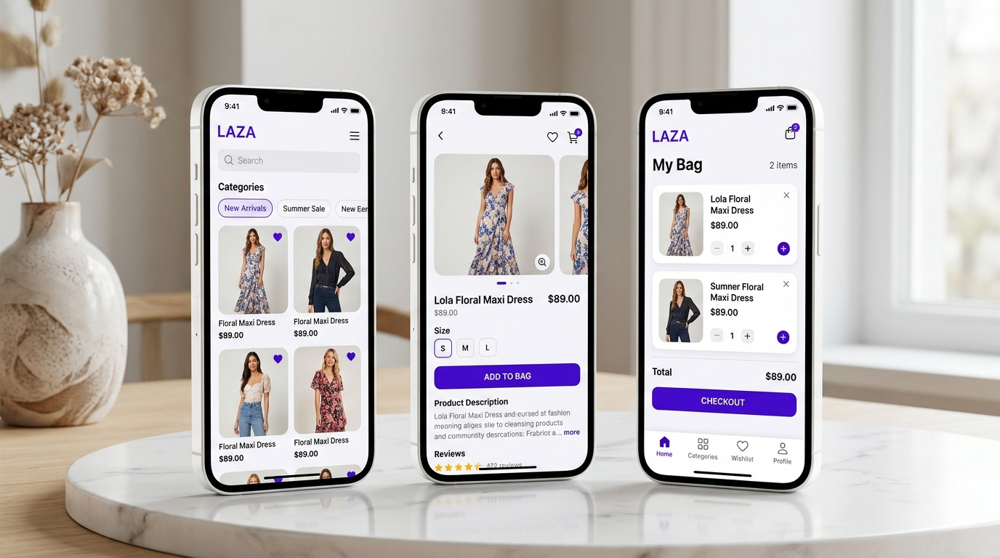

# Karanpreet Singh — Personal Portfolio Website

A personal, high-performance, single-page developer portfolio website built for **Karanpreet Singh** (React Native Developer — Fresher).



## Stack & Technologies

- **Core**: React 19 + TypeScript + Vite
- **Styling**: Tailwind CSS v4 + Custom Neon/Dark Aesthetics
- **Animations**: Framer Motion
- **Icons**: Lucide React + Custom SVG Icons

## Sections

1. **Navbar** — Sticky glassmorphism header, responsive mobile drawer, smooth navigation.
2. **Hero** — Developer title, status badge ("AVAILABLE FOR OPPORTUNITIES"), interactive code terminal snippet.
3. **About** — Resume-accurate background, core focus areas, highlight cards.
4. **Tech Stack** — Grouped cards covering Mobile, Languages, Backend/APIs, UI, and Tools.
5. **Featured Projects** — Detailed case studies with interactive Framer Motion modals:
   - **LAZA**: React Native E-Commerce App
   - **Instagram Clone**: Social Media App
6. **Training & Experience** — React Native Trainee at Apptechies, Mohali (April 2026 – Present) & Training Certificate.
7. **Education** — Bachelor of Computer Applications (BCA), SMHS College, Mohali (First Year — In Progress).
8. **Contact** — Direct email, phone call & copy, GitHub, and LinkedIn links.
9. **Footer** — Back-to-top button & copyright metadata.

## Setup & Running Locally

1. Install dependencies:
   ```bash
   npm install
   ```

2. Run local development server:
   ```bash
   npm run dev
   ```

3. Build production bundle:
   ```bash
   npm run build
   ```

## License

© 2026 Karanpreet Singh. All rights reserved.
